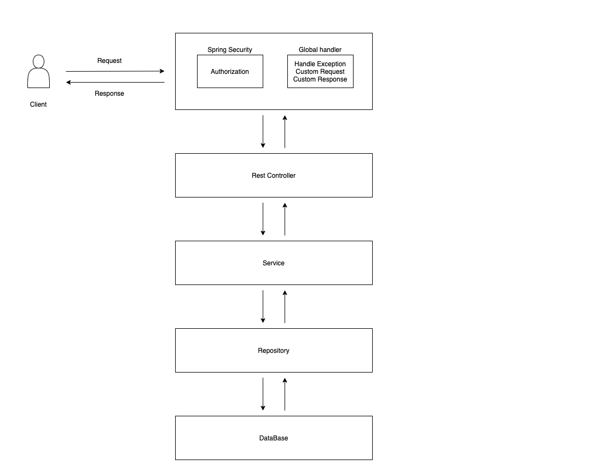
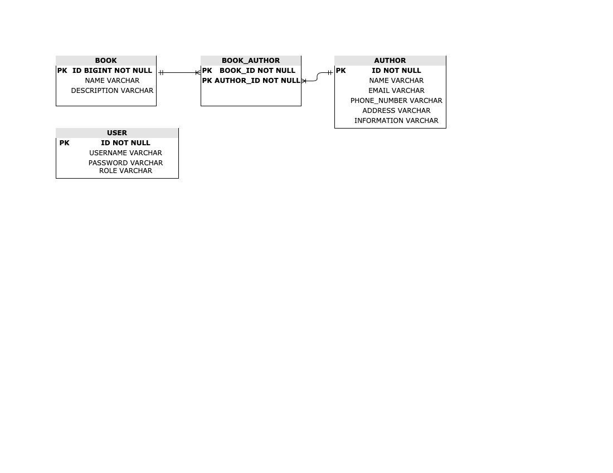

# DEMO SERVICE

## Table of contents
* [General info](#general-info)
* [Software Architecture](#software-architecture)
  * [Design Pattern](#design-pattern)
  * [Principles](#principles)
  * [Diagrams](#diagrams)
    * [Process Flow Diagram](#process-flow-diagram)
    * [Entity Diagram](#entity-diagram)
  * [SourceCode Structure](#sourcecode-structure)
* [Technologies](#technologies)
  * [Framework](#framework)
  * [Technical Stack](#technical-stack)
  * [Dependencies](#dependencies)
* [Setup](#setup)
  * [Build Project](#build-project)
  * [General Configuration](#general-configuration)
  * [Database Configuration](#database-configuration)
* [Test and Verify](#test-and-verify)

## General info
This project is a simple demo for interviewing at SOFTBRAIN.
    
## Software Architecture

### Design Pattern
  * MVC pattern: by using Spring MVC
  * FrontController pattern: by using DispatcherServlet to delegate request from client to controller
  * Singleton pattern: by using Autowire annotation
  * Builder pattern: by using Lombok
  
### Principles
  * SOLID
  * DRY
 
### Diagrams
  #### Process Flow Diagram
   
  #### Entity Diagram
   

### SourceCode Structure
``` 
.
├── _blob                        # Store the images for the README file
├── src                          # Source code
    ├──main
       ├──java
         ├──demoservice
            ├──configuration     # configuration for bean, security, swagger, exception
            ├──constants         # define the constants
            ├──entity            # define entities
            ├──exception         # define the exceptions
            ├──repository        # define the repositories
            ├──rest              # define the rest apis and payloads
            ├──serivce           # define the serivces
            ├──utils             # define the utils class
       ├──resources              # store the resources : db migration, key, application configs
   ├──test                       # for the unit tests
└── README.md                    # for README information
``` 

## Technologies
### Framework
  * Spring boot v2.4.5
  * Spring MVC
  * Spring security
### Technical Stack
  * Java 8
  * Rest API
  * H2 Database
  * Flyway
### Dependencies
  * Lombok
  * Log4j
  * Gson
  * Modelmapper

## Setup
### Build Project
  * Go to the project folder and run below command
  > mvn clean install
  * To run the project, you can run the jar file, or execute the below command
  > mvn spring-boot:run
### General Configuration
  #### Turn off SSL verification
    * Turn off SSL for postman
    
  #### Setting basic authentication
    * Setting basic username/password for postman
    
  #### Swagger
    * You can also use Swagger UI at : https://localhost:9000/demo-service/swagger-ui/
    
  
### Database Configuration

#### Allow invalid resource for localhost on chrome
  * On chrome, go to : "chrome://flags/", and enable: Allow invalid certificates for resources loaded from localhost.
  
#### Login into H2 Database
  * Login into H2
  
#### Config for H2 Databse
  * H2 configuration
   

  
## Test and Verify

### Book APIs
* Search Book by Author name
  * Url : https://localhost:9000/demo-service/api/books/search-by-author
  * Method : POST
  * Body
  ```
  {
    "header": {
        "appId": "demo service",
        "requestDt": "20210512205441"
    },
    "body": {
        "authorName": "Author",
        "requireMatch": false
    }
  }
  ```
  
  
* Get all Book
  * Url : https://localhost:9000/demo-service/api/books
  * Method : GET
  
  
* Get all Book by id
  * Url : https://localhost:9000/demo-service/api/books/1
  * Method : GET
  
  
* Create Book
  * Url : https://localhost:9000/demo-service/api/books
  * Method : POST
  * Body
  ```
  {
    "header": {
        "appId": "demo service",
        "requestDt": "20210513205441"
    },
    "body": {
        "name": "Book 6",
        "description": "Book desc 6",
        "authors": [{
            "id": 3},
            {"id": 1}
        ]
      }
  }
  ```
  
  
* Update Book
  * Url : https://localhost:9000/demo-service/api/books
  * Method : PUT
  * Body
  ```
  {
    "header": {
        "appId": "demo service",
        "requestDt": "20210512205441"
    },
    "body": {
        "name": "New Book 3",
        "description": "New Book desc 3",
        "authors": [
            {"id": 2},
            {"id": 3}
        ]
    }
  }
  ```
  
  
  * Delete Book by id
  * Url : https://localhost:9000/demo-service/api/books/1
  * Method : DELETE
  
  
### Author APIs
* Search Author by email & phone number
  * Url : https://localhost:9000/demo-service/api/authors/search-by-email-and-phone-number
  * Method : POST
  * Body
  ```
  {
    "header": {
        "appId": "demo service",
        "requestDt": "20210512205441"
    },
    "body": {
        "email": "email",
        "phoneNumber": "2",
        "requireMatch": false
    }
  }
  ```
  
  
* Get all Authors
  * Url : https://localhost:9000/demo-service/api/authors
  * Method : GET
  
  
* Get Author by id
  * Url : https://localhost:9000/demo-service/api/books/1
  * Method : GET
  
  
* Create Author
  * Url : https://localhost:9000/demo-service/api/authors
  * Method : POST
  * Body
  ```
  {
  "header": {
    "appId": "demo service",
    "requestDt": "20210512205441"
  },
  "body": {
    "name": "Author 6",
    "email": "Email6@gmail.com",
    "phoneNumber": 6666666666,
    "address": "Author address 6",
    "information": "Author Information 6",
    "bookIds": [ 
        {"id": 2},
        {"id": 3}
        ]
    }
  }
  ```
  
  
* Update Author
  * Url : https://localhost:9000/demo-service/api/authors/1
  * Method : PUT
  * Body
  ```
  {
    "header": {
        "appId": "demo service",
        "requestDt": "20210512205441"
    },
    "body": {
        "name": "New Author 555",
        "email": "newEmail@gmail.com",
        "phoneNumber": "1112223333",
        "information": "New information"
    }
  }
  ```
  
  
 * Delete Author by id
    * Url : https://localhost:9000/demo-service/api/authors/1
    * Method : DELETE
    

  
  
